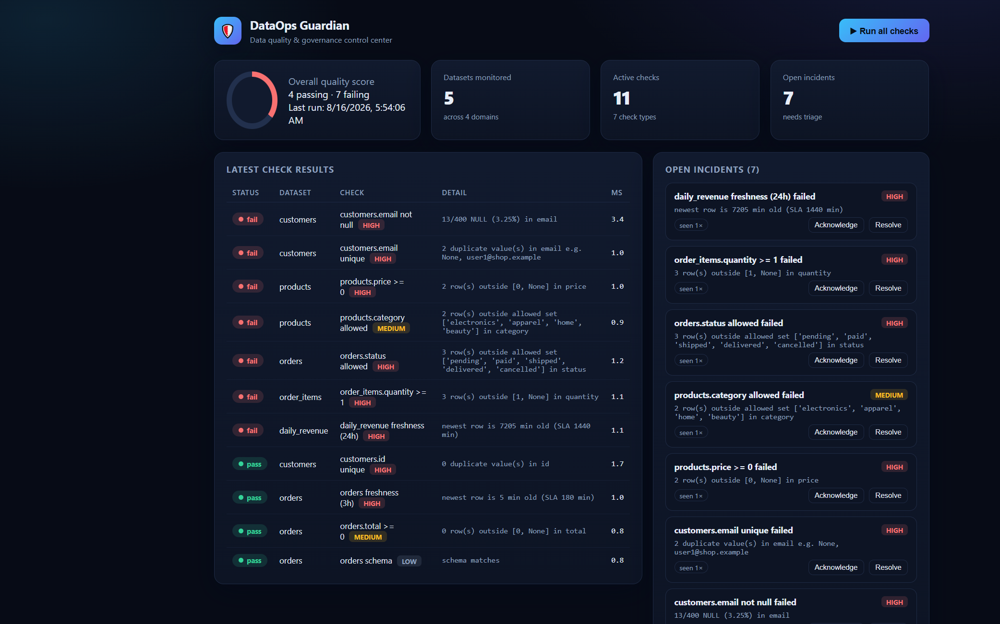
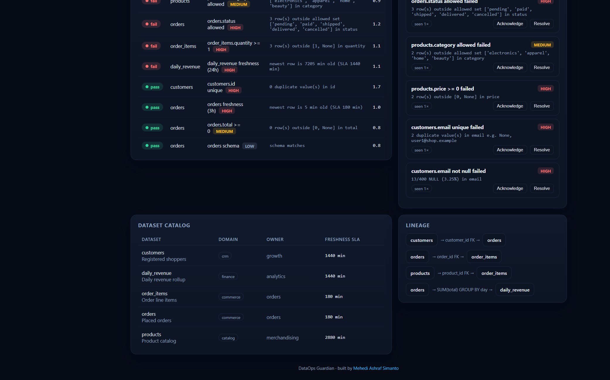
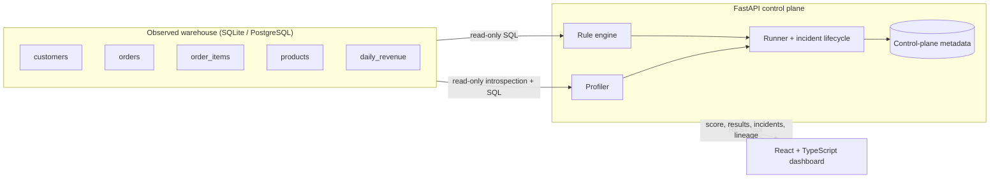

<div align="center">

# 🛡️ DataOps Guardian

**A data quality & governance control center for analytics warehouses.**

Profiles tables, runs configurable quality checks, opens/auto-resolves incidents, tracks lineage, and scores overall data health — with a premium real-time dashboard.

[](https://github.com/simanto4321/dataops-guardian/actions/workflows/ci.yml)


</div>



---

## Why this exists

Broken data silently breaks decisions. A NULL email, a duplicate key, a negative
price, a stale rollup — each one erodes trust in the warehouse. **DataOps Guardian**
is a lightweight, self-hostable control plane that continuously validates your
warehouse and turns quality problems into tracked, triageable incidents.

It ships with a realistic e-commerce warehouse (customers, products, orders,
order_items, daily_revenue) seeded with **intentional data issues**, so you can
see the whole workflow working in under two minutes.

## Features

- **7 portable check types** — `not_null`, `unique`, `accepted_values`, `range`, `freshness`, `row_count`, and `schema` (drift detection). All compile to SQL that runs on both SQLite and PostgreSQL.
- **Column profiling** — null rate, distinct/unique rate, min/max per column, computed on demand.
- **Incident lifecycle** — failing checks open incidents; a passing run **auto-resolves** them. Analysts can acknowledge/resolve from the UI.
- **Run history & audit log** — every run and analyst action is recorded.
- **Data lineage** — upstream → downstream edges with transformation notes.
- **Quality score** — a single 0–100 health number for the whole warehouse.
- **Premium dashboard** — React + TypeScript, responsive, dark, zero-config dev proxy.
- **Safety first** — identifier whitelisting + parameterized SQL; checks never raise, they return structured `error` results.

## Screenshots

| Control center | Catalog & lineage |
|---|---|
|  |  |

## Architecture



See [docs/ARCHITECTURE.md](docs/ARCHITECTURE.md) for the full design, data model, and check semantics.

## Quick start

### Option A — one command (Docker)

```bash
docker compose up --build
# open http://localhost:8080  (Postgres + API + web, auto-seeded)
```

### Option B — local dev (no Docker)

**Backend** (Python 3.12+):

```bash
cd backend
python -m venv .venv
# Windows: .venv\Scripts\activate   |   macOS/Linux: source .venv/bin/activate
pip install -r requirements.txt
python -m app.seed                  # seed warehouse + checks (SQLite by default)
uvicorn app.main:app --reload --port 8000
```

API docs: http://127.0.0.1:8000/docs

**Frontend** (Node 18+):

```bash
cd frontend
npm install
npm run dev                         # http://localhost:5173 (proxies /api → :8000)
```

Click **Run all checks** — you should see ~7 failures surface from the injected issues.

## Check types

| Type | Config | Fails when |
|------|--------|-----------|
| `not_null` | `max_failure_rate` | NULL rate exceeds the threshold |
| `unique` | `max_duplicates` | duplicate values exist |
| `accepted_values` | `values: [...]` | a value is outside the allowed set |
| `range` | `min`, `max` | numeric value is out of bounds |
| `freshness` | `sla_minutes` | newest timestamp is older than the SLA |
| `row_count` | `min`, `max` | row count is outside the expected window |
| `schema` | `columns: [...]` | expected columns are missing (drift) |

## API overview

| Method | Path | Description |
|--------|------|-------------|
| GET | `/api/health` | Liveness probe |
| GET | `/api/summary` | Quality score + counts |
| GET | `/api/datasets` | Registered datasets |
| GET | `/api/datasets/{id}/profile` | Column profiling |
| GET/POST/DELETE | `/api/checks` | Manage checks |
| POST | `/api/runs` | Trigger a full check run |
| GET | `/api/runs`, `/api/runs/{id}/results`, `/api/results/latest` | Run history & results |
| GET/PATCH | `/api/incidents` | Incident triage |
| GET | `/api/lineage` | Lineage edges |

## Testing

```bash
cd backend
pytest -q          # 17 tests: rule engine + full API flow
```

```bash
cd frontend
npm run build      # tsc type-check + production build
```

## Project structure

```
dataops-guardian/
├── backend/            # FastAPI control plane
│   ├── app/
│   │   ├── checks.py       # the 7-type rule engine
│   │   ├── profiling.py    # column profiler
│   │   ├── runner.py       # run orchestration + incident lifecycle
│   │   ├── warehouse.py    # read-only warehouse accessor
│   │   ├── models.py       # control-plane metadata (SQLAlchemy)
│   │   ├── schemas.py      # pydantic API models
│   │   ├── seed.py         # realistic warehouse + injected issues
│   │   └── main.py         # REST API
│   └── tests/
├── frontend/           # React + TypeScript dashboard (Vite)
├── docs/               # architecture + assets
└── docker-compose.yml  # Postgres + API + web
```

## Roadmap

- Slack / email incident notifications
- Scheduled runs (cron) + historical score trend
- Anomaly detection on profiling metrics
- Column-level lineage and impact analysis

## Author

**Mehedi Ashraf Simanto** — [@simanto4321](https://github.com/simanto4321) · msimanto46@gmail.com

Licensed under the [MIT License](LICENSE).
