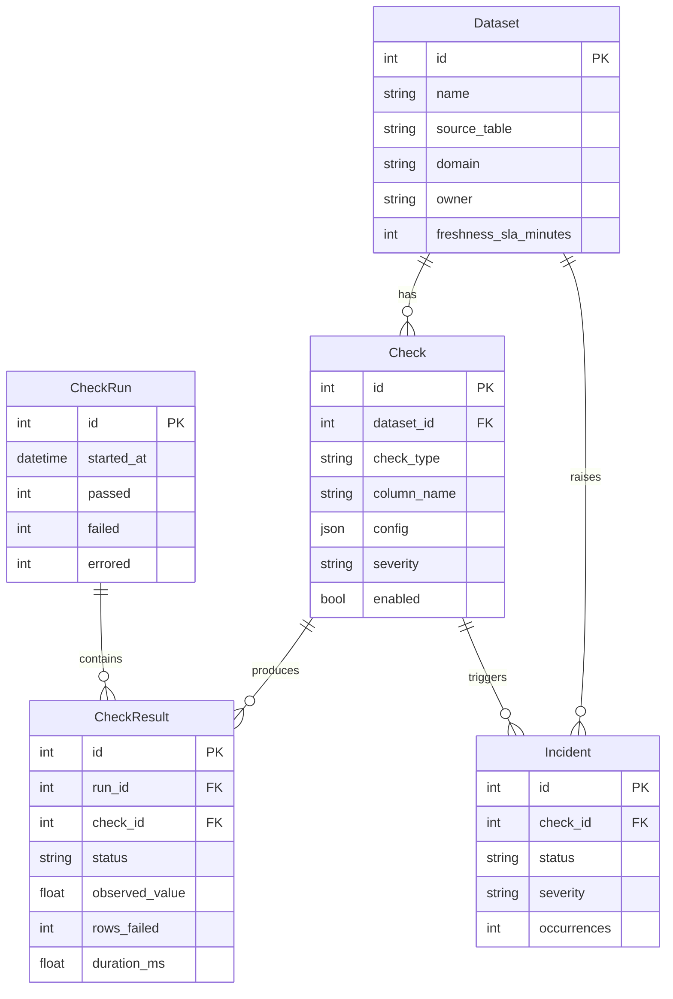

# Architecture

DataOps Guardian is split into two logical databases and three runtime components.

## Two databases, on purpose

| Store | Purpose | Engine |
|-------|---------|--------|
| **Observed warehouse** | The data under test (customers, orders, ...). Accessed read-only. | `warehouse.py` |
| **Control-plane metadata** | Datasets, checks, runs, results, incidents, lineage, audit log. | `models.py` |

By default both point at the same SQLite file for a frictionless demo, but they
use separate engines and can be split (e.g. control plane on Postgres, warehouse
on Snowflake/BigQuery/another Postgres). This mirrors how real observability
tools store their own metadata separately from the systems they watch.

## Components

### 1. Profiler (`profiling.py`)
Computes per-column statistics with portable SQL: row count, NULL count/rate,
distinct count, unique rate, min/max. Identifiers are whitelisted and quoted.

### 2. Rule engine (`checks.py`)
Each check type compiles to parameterized SQL and returns a normalized
`CheckOutcome(status, observed_value, rows_scanned, rows_failed, message)`.
The engine is intentionally **exception-safe**: any failure (missing table,
bad identifier, driver error) becomes a structured `error` outcome instead of
crashing a run. `execute_check()` also returns wall-clock duration for each check.

### 3. Runner (`runner.py`)
Orchestrates a run:

1. Create a `CheckRun`.
2. Execute every enabled check, persisting a `CheckResult` each.
3. On **fail** → open or increment an `Incident`.
4. On **pass** → auto-resolve any open incident for that check.
5. Finalize run counts and write an `AuditLog` entry.

## Data model

## Check semantics

| Type | SQL strategy |
|------|--------------|
| `not_null` | `COUNT(*) WHERE col IS NULL`, compared to `max_failure_rate` |
| `unique` | `GROUP BY col HAVING COUNT(*) > 1` |
| `accepted_values` | `col NOT IN (:values)` with bound params |
| `range` | `col < min OR col > max` |
| `freshness` | `MAX(ts)` vs now, compared to `sla_minutes` |
| `row_count` | `COUNT(*)` vs `[min, max]` |
| `schema` | expected columns − introspected columns |

## Security notes

- All table/column identifiers are validated against `^[A-Za-z0-9_]+$` and quoted;
  values are always passed as bound parameters. There is no string interpolation
  of user-supplied values into SQL.
- The warehouse connection is used read-only by the engine. In production, grant
  the app a read-only role and keep the control-plane store on a separate credential.
- Checks are sandboxed to return structured errors, so a single bad check cannot
  crash a run or leak stack traces to the API.

## Limitations

- The bundled demo uses SQLite; some engine-specific optimizations (approximate
  distinct, sampling) are out of scope for the reference implementation.
- Scheduling is manual/API-triggered in this version (see roadmap for cron).
